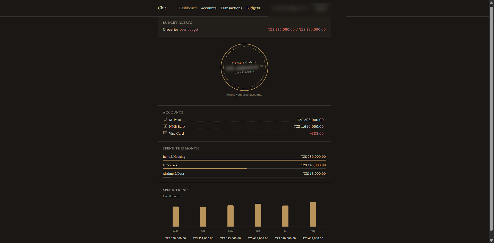
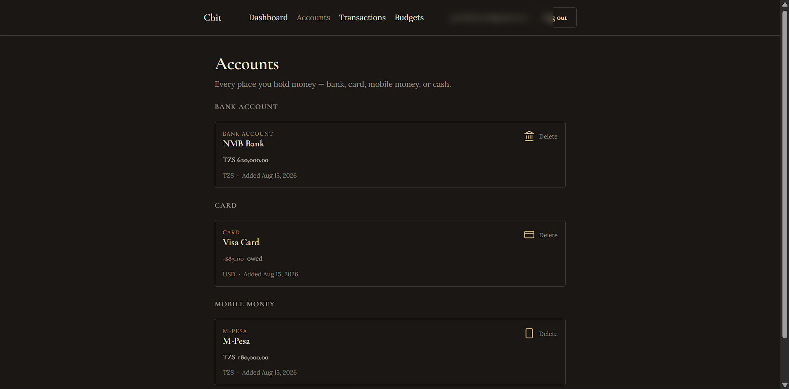
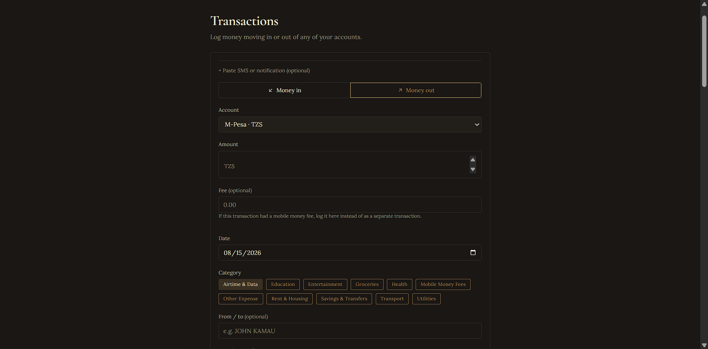
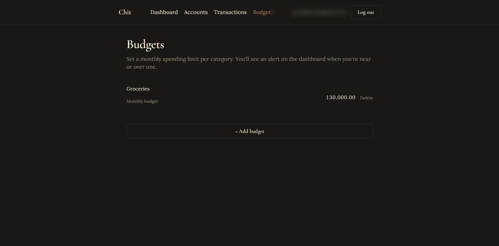

# Chit

A passbook-style personal finance tracker — one line per account, first-class support for mobile money wallets (M-Pesa, Tigo Pesa, Airtel Money, and more) alongside banks, cards, and cash, not bolted on as an afterthought.

## Live demo

**[personal-finance-tracker-sigma-peach.vercel.app](https://personal-finance-tracker-sigma-peach.vercel.app)**

## Preview

<!--
  Drop screenshots into /docs with these filenames and they'll show up here
  automatically:
  - screenshot-dashboard.png  (balance ring + spend trend)
  - screenshot-accounts.png   (multi-wallet account list)
  - screenshot-transactions.png (SMS-paste transaction entry)
  - screenshot-budgets.png    (budget list + dashboard alert)
-->



| | |
|---|---|
|  |  |
|  | |

## Features

- **Every wallet in one place** — bank, card, mobile money, or cash, each with its own currency, shown as a single running balance
- **Paste a mobile money SMS, skip the typing** — drop in a confirmation text and the amount, direction, fee, and counterparty prefill automatically
- **Budgets that actually alert you** — set a monthly limit per category and get a dashboard banner the moment you're near or over it
- **Spend trends without spreadsheets** — a 6-month spend chart and current-month category breakdown, computed live from your transactions
- **Multi-currency net worth** — hold accounts in more than one currency and your total balance converts to a single figure automatically
- **Privacy by default** — your total balance is blurred until you tap to reveal it, and re-hides itself if you switch away
- **Locked down at the database, not just the app** — every table is scoped to its owning user with row-level security; there's no query path that can leak one user's data to another

## How to use

1. Sign up and confirm your email
2. Add your first account — bank, mobile money, card, or cash
3. Log transactions by typing them in, or paste a mobile money SMS and let it prefill
4. Set a monthly budget per category to get alerted when you're close to the limit
5. Check the dashboard for your balance, spend trend, and category breakdown

## Project structure

```
src
├── app
│   ├── accounts/          # multi-wallet account CRUD
│   ├── api/health/        # Supabase keep-alive ping (see .github/workflows)
│   ├── auth/confirm/      # email confirmation link handler
│   ├── budgets/           # monthly budgets + alert logic
│   ├── dashboard/         # balance ring, spend trend, category breakdown
│   ├── login/, signup/    # auth pages
│   ├── privacy/, terms/   # plain-language legal pages
│   ├── transactions/      # transaction entry + SMS-paste parser
│   ├── icon.svg, apple-icon.tsx  # app icon
│   └── globals.css        # design tokens (Tailwind v4 @theme)
├── components/            # shared UI: header, balance ring, icons
├── lib/
│   ├── sms-parser.ts      # parses mobile money confirmation text
│   ├── fx.ts              # multi-currency conversion
│   └── supabase/          # browser/server clients, auth middleware
└── proxy.ts               # Next.js 16 middleware (route auth guard)
```

## Tech stack

- [Next.js](https://nextjs.org) 16.3.1 (App Router, Server Actions, Turbopack)
- [React](https://react.dev) 19.2.8
- [Supabase](https://supabase.com) — Postgres + Auth, row-level security (`@supabase/supabase-js` 2.112.3, `@supabase/ssr` 0.12.4)
- [Tailwind CSS](https://tailwindcss.com) 4
- TypeScript 5
- [open.er-api.com](https://www.exchangerate-api.com/) — free exchange-rate data for multi-currency conversion

## Setup

1. Install dependencies:

   ```bash
   npm install
   ```

2. Create a Supabase project, then copy `.env.local.example` to `.env.local` and fill in the values from **Project Settings → API**:

   ```bash
   cp .env.local.example .env.local
   ```

3. Apply the database schema: open the Supabase SQL Editor and run, in order, everything under `supabase/migrations/`.

4. In Supabase Dashboard → Authentication → URL Configuration, add `http://localhost:3000/auth/confirm` as a redirect URL (and your production URL once deployed).

5. Run the dev server:

   ```bash
   npm run dev
   ```

## Data model

- `accounts` — one row per wallet: type (`bank` / `card` / `mobile_money` / `cash` / `other`), a free-text `provider` for mobile money, currency, and starting balance.
- `categories` — shared defaults (income/expense) plus per-user custom categories.
- `transactions` — amount, currency, direction, category, optional fee and counterparty, scoped to one account.
- `budgets` — a monthly spending limit per category, compared against the current month's transactions to drive dashboard alerts.

Row-level security is enabled on every table, scoping every row to `auth.uid()`; see `supabase/migrations/` for the exact policies.

## License

[MIT](LICENSE)
